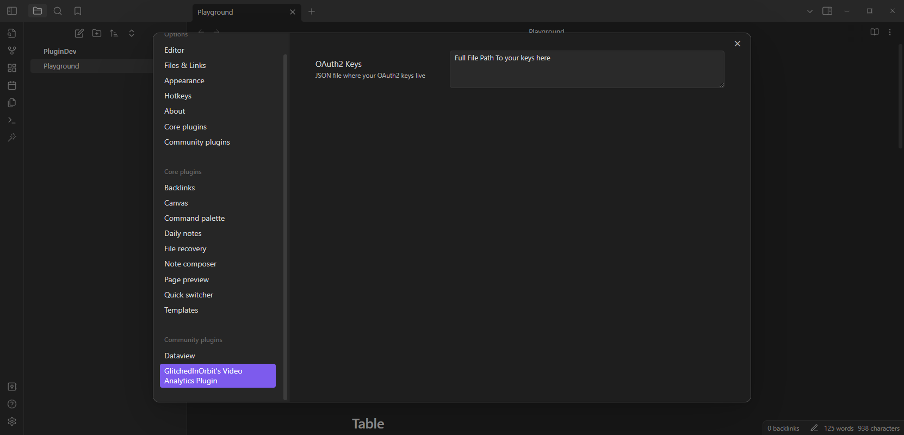
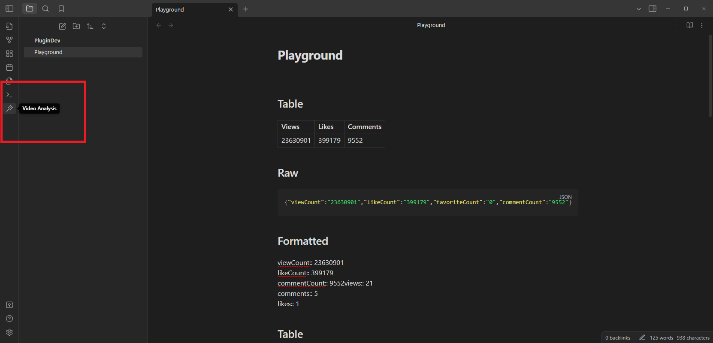
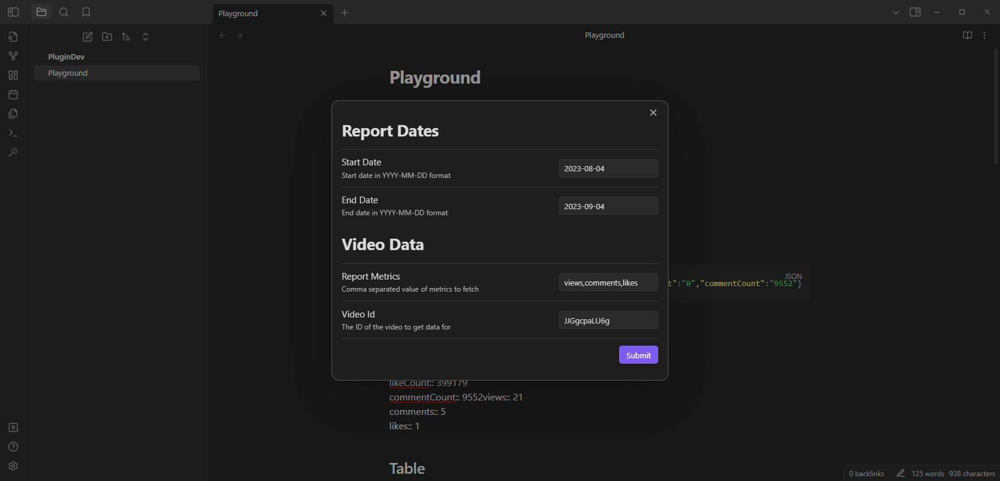
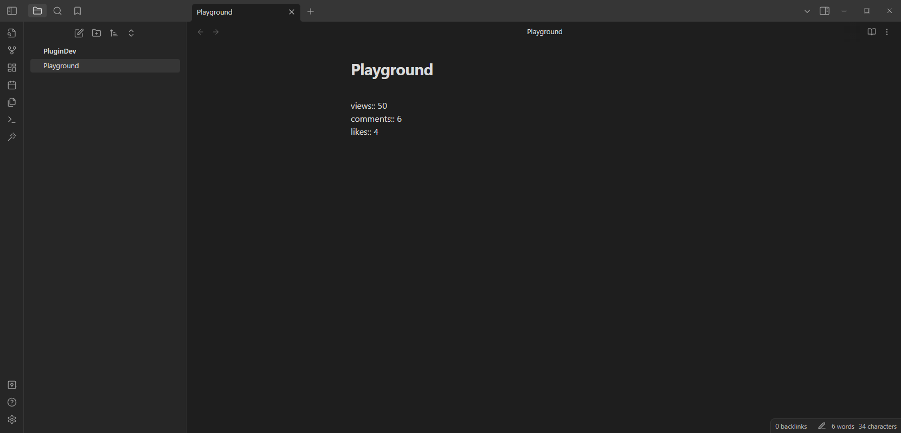

# Youtube Analytics Plugin

If you've never made a plugin, see the [Sample Readme](./README_SAMPLE.md).


## Intention

This plugin was built to support interacting with the [YouTube Analytics Apis](https://developers.google.com/youtube/analytics). 

This uses Google's [Local Auth](https://cloud.google.com/nodejs/docs/reference/local-auth/latest) client to support OAuth2 authorization.

## Installation

### Prequisites

You must have the same prerequisites as if you were to make [your own plugin](https://docs.obsidian.md/Plugins/Getting+started/Build+a+plugin#Prerequisites)

### Steps

1. Use the instructions on installing a [Community Plugin](https://help.obsidian.md/Extending+Obsidian/Community+plugins#Install+a+community+plugin) to find the plugin directory for your vault.
2. Clone the repository to that location and initialize it like you would your own plugin:
```bash
git clone https://github.com/AnEmortalKid/glitched-analytics-plugin
npm i
npm run build
```


## Configuration

The plugin requires a `JSON` file with OAuth2 credentials configured to retrieve Analytics and Reporting data. 

**You must provide your own.**

### OAuth Constent Screen

I recommend setting the Test users to just your email, so only you can get access to your OAuth Apps.


### Details

* To configure those, follow [this](https://developers.google.com/youtube/reporting/v1/reports)
* You'll then download your json keys, as indicated [here](https://cloud.google.com/nodejs/docs/reference/google-auth-library/latest#oauth2)
  * Save them somewhere on your machine, you'll need them later.

The plugin requires that you configure the full path to that json file:


## Usage

Once your keys are configured, you can call the Youtube Analytics API and retrieve Video reports.

1. Use the magic wand on the left to retrieve a Report

2. Enter the desired attributes (start date, end date, additional metrics and youtube video id)

3. Once you press submit, the data will be pasted on your Editor


